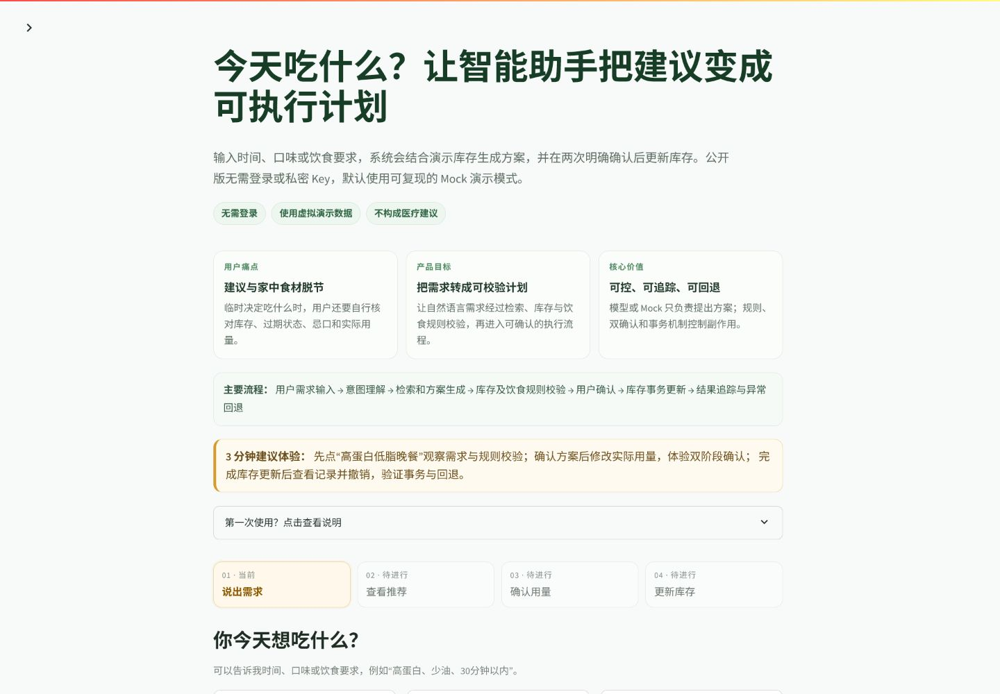

# Auto-LifeOS Public Demo

Auto-LifeOS 是一个面向普通用户的饮食推荐公开演示。用户只需要说出时间、口味或饮食要求，就能按“说出需求—查看推荐—确认用量—更新库存”四步完成体验，并在需要时撤销更新。

线上地址：[https://auto-lifeos-demo.streamlit.app/](https://auto-lifeos-demo.streamlit.app/)

## 第一次使用

1. 直接输入想吃什么，或点击任意示例。
2. 点击“帮我推荐”。
3. 查看菜名、时间、营养、食材和简单做法。
4. 点击“这个方案可以”，再核对实际使用量。
5. 第二次确认后查看演示库存变化，需要时可以撤销。

无需登录、无需 API Key。所有用户、食材、饮食习惯和实验数据都是 synthetic/sample，不构成医疗建议。

如果想先调整食材，可以点击首页的“先调整演示库存”。不调整也可以直接使用 9 项基础库存完成原有流程。

## 界面预览

桌面版首页：



手机版首页（390×844）：


## 信息架构

- **开始体验**：四步渐进式推荐流程，只显示当前需要完成的操作。
- **演示库存**：查看当前浏览会话的虚拟食材及到期状态。
- **使用记录**：查看食材更新前后数量，并撤销最近一次更新。
- **了解项目原理**：集中展示 LangGraph、知识检索、Agent Trace、Prompt 对比、工程测试与安全限制。

## 公开演示边界

- 强制使用 Mock Provider，不连接外部模型，不需要任何 API 凭据。
- 所有用户、库存、知识库与 A/B 数据均为 synthetic/sample。
- 每个 Streamlit 浏览会话使用独立的临时 SQLite 数据库；新会话恢复相同基线。
- 数据只用于软件演示，服务重启后可以重置，不构成医疗建议。
- 项目不包含真实用户数据、本地数据库、求职资料或主项目 Git 历史。

## 编辑演示库存

“演示库存”页面支持搜索、新增、修改数量与单位、修改保质期与存放位置、删除，以及恢复当前会话的初始库存。

- 每个新会话从 9 项 synthetic/sample 基础库存开始。
- “西红柿”“鸡胸”“燕麦片”等别名会映射到已有标准食材。
- 添加重复食材时不会生成重复记录，用户可以确认合并数量或取消。
- 未收录的新食材会获得当前会话专属 ID，并标记“营养数据暂缺”；系统不会编造营养数值。
- 删除采用软删除：食材不再参与推荐，但历史饮食事务仍可读取。
- 新增、合并、修改、删除和恢复都会写入当前会话审计记录。
- 推荐每次都读取修改后的有效库存；过期、数量不足或已删除食材不能进入可执行计划。

## 功能

- 普通中文引导、三个一键示例与手机友好的四步流程
- 会话级演示库存搜索、新增、修改、软删除、恢复与审计
- 智能饮食推荐与 Pydantic 结构化计划
- 库存、过敏原、过期、单位与营养范围的确定性校验
- 方案确认、实际用量修改、实际使用量确认
- 原子库存扣减、前后对比与当前会话撤销
- TF-IDF 私域知识检索
- 可读的 LangGraph Agent 执行轨迹
- 两种 Prompt 各 20 个合成案例的对比实验
- 会话隔离、架构与安全说明

技术内容保留在“了解项目原理”和“查看详细技术信息”中，不干扰首次体验。

## 本地运行

需要 Python 3.11。

```bash
python -m venv .venv
source .venv/bin/activate
pip install -r requirements.txt
python -m streamlit run app.py
```

Windows PowerShell 激活命令为 `.venv\\Scripts\\Activate.ps1`。

## 测试

```bash
pip install pytest
python -m pytest -q
```

测试覆盖首次访问引导、三个示例按钮、渐进式主流程、库存搜索与编辑、别名合并、自定义食材、软删除历史一致性、实时推荐联动、实际用量修改、换方案、撤销、技术页面、双会话数据库隔离、跨会话扣减/撤销、新会话基线、两阶段确认、Mock 强制模式、凭据读取与可移植路径。

## 部署

Streamlit Community Cloud 配置：

- Repository：`auto-lifeos-demo`
- Branch：`main`
- Main file path：`app.py`
- Python：`3.11`
- Secrets：留空

详细步骤与验收项见 [DEPLOYMENT.md](DEPLOYMENT.md)。

## License

MIT License。演示中的一般饮食信息不构成医疗建议。
